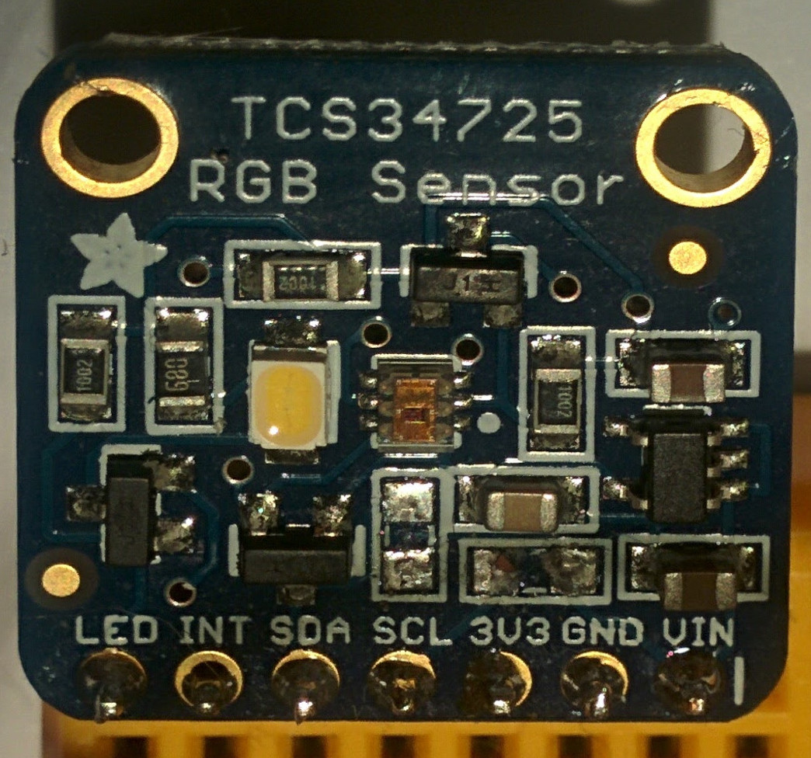

# legoev3_tcs34725
An active color-sensor based on TCS34725 for lego mindstorms ev3. The goal is to have a color sensor that can sense
colors on screns or color on surfaces illuminated by leds.

# 1st prototype
The prototype is based on the [Adafruit RGB Color Sensor with IR filter and White LED - TCS34725](https://www.adafruit.com/product/1334).
Unfortunately this breakout board already has 10k pullup resistors for the I2C lines. The LEGO EV3 requires
82k pullup resistors instead. So the first step was to remove the two SMD resistors above the SCL and 3V3 pins:



Next I plugged the board on a mini breadboard and added 82k resistos and also connected the LED pin to GND to disable
the led on the breakout. The LED is only needed to sense reflected light.

The sensor uses a mindstorms cable which I have cut in half and conncted the wires as below:

EV3 Cable | Adafruit pin (JP1)
--------|-----------
Pin 1 (white) | N/C
Pin 2 (black) | N/C
Pin 3 (red) | GND
Pin 4 (green) | VIN
Pin 5 (yellow) | SCL
Pin 6 (blue) | SDA

# demo code

Once the sensor is plugged, the right port mode needs to be choosen (below it has been plugged to port '1':

``` shell
echo "other-i2c" | sudo tee /sys/devices/platform/legoev3-ports/lego-port/port0/mode
```

Copy sensor-test.py to the ev3 and run it. It will print brightness and r,g,b values as soon as the change.

``` shell
$ python3 ./sensor-test.py
Device found
#090605: C: 3551, R: 2491, G: 1541, B: 1450
#090505: C: 3470, R: 2413, G: 1509, B: 1413
#0a0707: C: 4664, R: 2724, G: 1942, B: 1913
#151719: C: 15740, R: 5509, G: 5899, B: 6506
```

# ev3 color sensor dimensions

Axis | mm | holes | remark
-----|----|-------|-------
Length | 40 mm | 5 |
Depth | 24 mm | 3 |
Height | 22 mm | 3 | without connector
Height | 31.35 mm | 4 | with connector

'holes' are sizes in lego technic beams.

# TODO

* turn code into library
* 3d prinable sensor case
* find a source for the modified RJ45 sockets
  * http://www.mindsensors.com/51-cables-connectors
  * http://www.mindsensors.com/ev3-and-nxt/117-nxtev3-compatible-female-sockets-5-pack
  * https://www.dexterindustries.com/shop/female-sockets-lego-mindstorms-nxt-and-ev3/
  * https://www.generationrobots.com/en/102_dexter-industries
* do a simplified PCB design
* consider making it an uart sensor
  * needs a MCU
  * https://lejosnews.wordpress.com/2014/06/04/arduino-ev3-uart-emulation-library/
  * https://github.com/lawrie/EV3_Dexter_Industries_Sensors/tree/master/EV3_arduino
  * http://lechnology.com/2014/09/using-uart-sensors-on-any-linux/
  * https://github.com/ev3dev/lego-linux-drivers/blob/master/sensors/ev3_uart_sensor_ld.c

# Links
* https://learn.adafruit.com/adafruit-color-sensors/downloads